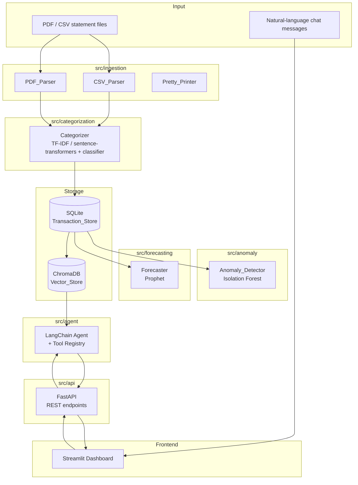

# Design Document — FinSight AI Platform

## Overview

FinSight AI is a single-user personal finance intelligence platform. It ingests bank and
credit card statements (PDF and CSV), persists parsed transactions in SQLite, applies ML
to auto-categorize and anomaly-score each transaction, generates per-category spending
forecasts via Prophet, and grounds a LangChain LLM agent in a ChromaDB vector store for
natural-language Q&A. All capabilities are exposed through a FastAPI REST backend and
consumed by a Streamlit dashboard frontend.

The system runs entirely on CPU-only hardware, is designed for incremental 30-day
development, and is used by a single developer/user.

### Design Goals

- **Modularity**: each capability (ingestion, categorization, anomaly detection,
  forecasting, agent, API, dashboard) is an independent Python module with a clean
  interface so it can be built and tested in isolation.
- **Consistency**: a single canonical `Transaction` dataclass flows through every layer;
  no layer re-parses raw data that a prior layer already parsed.
- **Correctness-first**: the data pipeline has round-trip guarantees so no information
  is silently lost between parsing, storage, and serialization.
- **Local-first**: all storage (SQLite, ChromaDB persistent directory) is on-disk; no
  cloud dependencies beyond an optional LLM API key.
- **Testability**: pure functions dominate the business logic so property-based tests
  can verify universal invariants cheaply.

---

## Architecture

The platform is organized as a layered pipeline with a shared domain model at its core.



### Request Flow — Ingestion

1. Client uploads a file to `POST /ingest`.
2. API detects file type (PDF / CSV) and delegates to the appropriate parser.
3. Parser returns a list of `Transaction` records plus a parse summary.
4. Categorizer enriches each record with a `category` label.
5. Transaction_Store inserts records (deduplication by `(date, merchant, amount, source_file)`).
6. Vector_Store indexes an embedding for each inserted record atomically (store insert rolls back on indexing failure).
7. Anomaly_Detector is re-run over all transactions; flags and scores are updated.
8. API returns the count of successfully ingested transactions.

### Request Flow — Chat

1. Client sends `{message, session_id}` to `POST /chat`.
2. Agent loads session memory for `session_id` (last 5 exchange pairs).
3. Agent plans tool calls: `retrieve_transactions`, `calculate_total`, `run_forecast`, or `get_anomalies`.
4. Tools execute against Transaction_Store / Vector_Store / Forecaster.
5. Agent synthesizes a grounded answer and appends the exchange to session memory.
6. API returns the answer string.

---

## Components and Interfaces

### Domain Model — `Transaction`

```python
from dataclasses import dataclass, field
from datetime import date
from typing import Optional

@dataclass
class Transaction:
    date: date
    merchant: str
    amount: float            # positive = debit/charge
    category: str = ""
    id: Optional[int] = None
    is_anomaly: bool = False
    anomaly_score: Optional[float] = None   # [0.0, 1.0], higher = more anomalous
    needs_review: bool = False
    source_file: str = ""
```

All modules import this shared dataclass from `src/domain.py`; no module defines its
own transaction representation.

---

### `src/ingestion` — Ingestion Module

#### `SyntheticGenerator`

```python
class SyntheticGenerator:
    CATEGORIES: dict[str, tuple[float, float]]  # category → (min_amount, max_amount)

    def generate(
        self,
        n: int = 3000,
        start_date: date = ...,
        end_date: date = ...,
        seed: Optional[int] = None,
    ) -> list[Transaction]: ...
    # Raises ValueError for n < 1, n > 100_000, or start_date > end_date

    def write_csv(self, transactions: list[Transaction], output_dir: Path) -> Path: ...
```

#### `CSVParser`

```python
@dataclass
class ParseSummary:
    parsed: int
    skipped: int
    warnings: list[str]   # "Row {n}: missing field '{field}'" or "Row {n}: bad value '{raw}'"
    file_errors: list[str]

class CSVParser:
    COLUMN_ALIASES: dict[str, str]   # variant name → canonical field

    def parse(self, file_path: Path) -> tuple[list[Transaction], ParseSummary]: ...
```

#### `PDFParser`

```python
class PDFParser:
    def parse(self, file_path: Path) -> tuple[list[Transaction], ParseSummary]: ...
```

Uses `pdfplumber` for text/table extraction; applies the same column alias mapping as
`CSVParser`.

#### `PrettyPrinter`

```python
class PrettyPrinter:
    CANONICAL_FIELDS = ("date", "merchant", "amount", "category")

    def to_csv(self, transactions: list[Transaction], output_path: Path) -> None: ...
    def to_csv_string(self, transactions: list[Transaction]) -> str: ...
```

Writes header `date,merchant,amount,category` in that exact order; date formatted as
`YYYY-MM-DD`.

---

### `src/categorization` — Categorization Module

```python
CANONICAL_CATEGORIES = frozenset({
    "Groceries", "Utilities", "Entertainment", "Dining",
    "Transport", "Healthcare", "Shopping", "Subscriptions",
    "Other", "Uncategorized",
})
CONFIDENCE_THRESHOLD = 0.60

class Categorizer:
    def train(self, labeled_transactions: list[Transaction]) -> float:
        """Train classifier. Returns weighted F1 on held-out validation set."""

    def predict(self, transaction: Transaction) -> Transaction:
        """Returns transaction with category and needs_review populated."""

    def predict_batch(self, transactions: list[Transaction]) -> list[Transaction]:
        """Processes all; sets category='Other', needs_review=True on individual errors."""

    def save(self, path: Path) -> None: ...
    def load(self, path: Path) -> None: ...
```

**Feature pipeline**: merchant text → TF-IDF vectorizer (or sentence-transformer
embeddings) → `LogisticRegression` or `LinearSVC` classifier. Both vectorizer and
classifier are saved together as a `sklearn.pipeline.Pipeline` via `joblib`.

---

### `src/anomaly` — Anomaly Detection Module

```python
class AnomalyDetector:
    def fit_and_score(self, store: TransactionStore) -> int:
        """
        Fits Isolation Forest on all transactions, updates is_anomaly + anomaly_score
        for every record. Returns count of flagged anomalies.
        Raises ValueError if store has < 10 transactions.
        """

    def get_anomalies(self, store: TransactionStore) -> list[Transaction]:
        """Returns all is_anomaly=True transactions ordered by anomaly_score desc."""
```

**Feature matrix**: `[amount, label_encoded_category]` — two numeric columns.
Anomaly score normalization: `score = (raw_decision * -1).clip(0, 1)` — Isolation
Forest's `decision_function` returns negative scores for anomalies; we invert and clip
to `[0, 1]`.

---

### `src/forecasting` — Forecasting Module

```python
@dataclass
class ForecastPoint:
    date: date
    yhat: float        # point estimate, floored at 0.0
    yhat_lower: float  # 95% CI lower, floored at 0.0
    yhat_upper: float  # 95% CI upper

@dataclass
class Forecast:
    category: str
    horizon_days: int
    points: list[ForecastPoint]

class Forecaster:
    def forecast_category(
        self,
        category: str,
        horizon_days: int,
        store: TransactionStore,
    ) -> Forecast:
        """
        Raises ValueError for horizon_days outside [1, 365].
        Raises ValueError if category has no transactions.
        Raises ValueError if category has < 14 distinct calendar days of history.
        """

    def forecast_all(
        self,
        horizon_days: int,
        store: TransactionStore,
    ) -> dict[str, Forecast | str]:
        """
        Returns dict mapping category → Forecast (on success) or error string
        (on insufficient data). Never raises.
        """
```

**Prophet configuration**: `yearly_seasonality` and `weekly_seasonality` read from
environment; `daily_seasonality=False`; `interval_width=0.95`.

---

### `src/agent` — Agent Module

```python
TOOL_REGISTRY = {
    "retrieve_transactions": retrieve_transactions_tool,
    "calculate_total": calculate_total_tool,
    "run_forecast": run_forecast_tool,
    "get_anomalies": get_anomalies_tool,
}

class FinancialAgent:
    def __init__(self, store: TransactionStore, vector_store: VectorStore,
                 forecaster: Forecaster, session_memory: dict[str, list]): ...

    def chat(self, message: str, session_id: str) -> str: ...
```

Session memory stores the last 5 `HumanMessage` + `AIMessage` pairs per `session_id`
in an in-process dict (sufficient for single-user use). Memory resets when a new
`session_id` is received that has no existing history.

**Out-of-scope guard**: before passing the message to the LangChain executor, a
lightweight classifier (keyword + LLM prompt prefix) checks whether the question is
finance-related; if not, the agent returns a canned "out-of-scope" response without
invoking any tools.

---

### `src/api` — FastAPI Backend

```
POST  /ingest                  → IngestResponse(ingested: int)
GET   /transactions            → list[TransactionDTO]
          ?start_date=YYYY-MM-DD
          ?end_date=YYYY-MM-DD
          ?category=str
GET   /anomalies               → list[TransactionDTO]
GET   /forecast/{category}     → ForecastDTO
          ?days=int (1–365, default 30)
POST  /chat                    → ChatResponse(answer: str)
GET   /docs                    → OpenAPI UI (FastAPI built-in)
```

All request validation is handled by Pydantic v2 models; invalid input returns HTTP 422.
Internal errors return HTTP 500 with a message field and a full stack trace logged at
ERROR level.

---

### `src/api/vector_store.py` — Vector Store

```python
class VectorStore:
    def __init__(self, persist_dir: str, embedding_model_name: str): ...

    def index(self, transaction: Transaction) -> None:
        """Insert or update embedding. Text = '{merchant} {category} {amount} {date}'."""

    def search(self, query: str, k: int) -> list[Transaction]: ...

    def delete(self, transaction_id: int) -> None:
        """No-op if id not found."""
```

**Embedding format**: `"{merchant} {category} {amount} {date}"` (space-separated, this
exact order per Requirement 8.1).  
**Model**: `all-MiniLM-L6-v2` (22 MB, CPU, 384-dim) — fast encode on CPU.  
**ChromaDB collection**: one persistent collection named `"transactions"`.

---

## Data Models

### SQLite Schema

```sql
CREATE TABLE transactions (
    id          INTEGER PRIMARY KEY AUTOINCREMENT,
    date        TEXT    NOT NULL,   -- ISO 8601: YYYY-MM-DD
    merchant    TEXT    NOT NULL,
    amount      REAL    NOT NULL,
    category    TEXT    NOT NULL DEFAULT '',
    is_anomaly  INTEGER NOT NULL DEFAULT 0,   -- 0 = false, 1 = true
    anomaly_score REAL,                        -- NULL until anomaly detection runs
    source_file TEXT    NOT NULL DEFAULT '',
    needs_review INTEGER NOT NULL DEFAULT 0
);

CREATE UNIQUE INDEX uq_transaction
    ON transactions(date, merchant, amount, source_file);
```

`needs_review` is stored so the API can surface low-confidence categorizations.

### ChromaDB Document

Each document in the `"transactions"` collection:

```json
{
  "id": "<transaction_id as string>",
  "document": "<merchant> <category> <amount> <date>",
  "metadata": {
    "transaction_id": 42,
    "date": "2024-03-15",
    "merchant": "Whole Foods",
    "amount": 87.43,
    "category": "Groceries"
  }
}
```

The `document` field drives similarity search; `metadata` fields enable post-retrieval
filtering and reconstruction of `Transaction` objects without a second SQL query.

### Configuration (`.env` / environment variables)

| Variable | Required | Default | Description |
|---|---|---|---|
| `SQLITE_DB_PATH` | ✓ | — | Path to SQLite `.db` file |
| `CHROMA_PERSIST_DIR` | ✓ | — | Directory for ChromaDB data |
| `EMBEDDING_MODEL_NAME` | ✓ | — | sentence-transformers model name |
| `LLM_API_KEY` | ✓ | — | API key for the LLM provider |
| `PROPHET_YEARLY_SEASONALITY` | — | `true` | Enable Prophet yearly seasonality |
| `PROPHET_WEEKLY_SEASONALITY` | — | `true` | Enable Prophet weekly seasonality |
| `LOG_LEVEL` | — | `INFO` | Python logging level |

### Pydantic Response DTOs (API layer)

```python
class TransactionDTO(BaseModel):
    id: int
    date: date
    merchant: str
    amount: float
    category: str
    is_anomaly: bool
    anomaly_score: Optional[float]
    needs_review: bool
    source_file: str

class ForecastPointDTO(BaseModel):
    date: date
    yhat: float
    yhat_lower: float
    yhat_upper: float

class ForecastDTO(BaseModel):
    category: str
    horizon_days: int
    points: list[ForecastPointDTO]

class IngestResponse(BaseModel):
    ingested: int

class ChatResponse(BaseModel):
    answer: str
```

---

## Correctness Properties

*A property is a characteristic or behavior that should hold true across all valid
executions of a system — essentially, a formal statement about what the system should do.
Properties serve as the bridge between human-readable specifications and
machine-verifiable correctness guarantees.*

The FinSight AI platform has several modules with pure or near-pure logic (synthetic
generation, CSV parsing, transaction storage, categorization, anomaly scoring, forecasting,
vector store indexing) where property-based testing can cheaply verify universal invariants
across thousands of generated inputs. Properties are listed below; each maps directly to
one or more acceptance criteria.

---

### Property 1: Generated transactions have all required fields

*For any* invocation of `SyntheticGenerator.generate()` with valid parameters (N in
[1, 100,000], start_date ≤ end_date), every record in the returned list SHALL have a
non-null `date`, a non-empty `merchant`, a non-zero `amount`, and a non-empty `category`.

**Validates: Requirements 1.1**

---

### Property 2: Generated record count and date bounds

*For any* valid N and date range [start_date, end_date], `SyntheticGenerator.generate()`
SHALL return exactly N records, and every record's `date` SHALL fall within the inclusive
[start_date, end_date] interval.

**Validates: Requirements 1.2**

---

### Property 3: Generated amounts are within per-category bounds

*For any* generated transaction record, its `amount` SHALL be within the declared
minimum and maximum amount range for its `category` (e.g., Groceries: $5–$300).

**Validates: Requirements 1.3**

---

### Property 4: Seeded generation is deterministic

*For any* valid seed value S and any valid generation parameters, two separate invocations
of `SyntheticGenerator.generate()` using the same S and parameters SHALL return lists where
every record has field values identical to the corresponding record in the other list, in
identical order.

**Validates: Requirements 1.5**

---

### Property 5: Invalid parameters produce errors and no output

*For any* invocation of `SyntheticGenerator.generate()` with N < 1, N > 100,000, or
start_date > end_date, a `ValueError` SHALL be raised and no output file SHALL be written.

**Validates: Requirements 1.7**

---

### Property 6: CSV parsing preserves all valid rows

*For any* valid UTF-8 CSV file containing R data rows with complete and parseable
`date`, `merchant`, and `amount` fields, `CSVParser.parse()` SHALL return exactly R
`Transaction` records with field values matching the source data.

**Validates: Requirements 2.1**

---

### Property 7: Column alias mapping produces correct canonical fields

*For any* CSV file using a known column name variant (e.g., "Description", "Narration",
"Debit", "Transaction Date"), `CSVParser.parse()` SHALL map each variant to its canonical
field and return `Transaction` records with those canonical fields correctly populated.

**Validates: Requirements 2.2**

---

### Property 8: Bad rows are skipped with correct per-row warnings

*For any* CSV where some rows are missing required fields or contain unparseable `date`
or `amount` values, `CSVParser.parse()` SHALL skip each such row and include a warning
entry containing the 1-based row number and the name of the failing field (or the raw
unparseable value). Skipping one bad row SHALL NOT affect parsing of other rows.

**Validates: Requirements 2.3, 2.4, 2.5**

---

### Property 9: Parse summary counts are consistent

*For any* CSV file, the `ParseSummary` returned by `CSVParser.parse()` SHALL satisfy
`parsed + skipped == total_data_rows`.

**Validates: Requirements 2.7**

---

### Property 10: CSV round-trip is lossless

*For any* non-empty list of valid `Transaction` records, serializing the list with
`PrettyPrinter.to_csv_string()` and then parsing the resulting string with
`CSVParser.parse()` SHALL produce a list of `Transaction` records where each record has
`date`, `merchant`, `amount`, and `category` values identical (character-for-character)
to the corresponding record in the original list.

**Validates: Requirements 2.8, 2.9**

---

### Property 11: Transaction_Store insert assigns unique IDs and deduplicates

*For any* list of Transaction records inserted into `TransactionStore`, each successfully
inserted record SHALL be assigned a unique `id`, the returned inserted count SHALL equal
the number of distinct (date, merchant, amount, source_file) combinations, and any
record with a combination already present in the store SHALL be counted as skipped
without creating a second database row.

**Validates: Requirements 4.2, 4.3**

---

### Property 12: Date range query returns only in-range records

*For any* non-empty Transaction_Store and any valid date range [start_date, end_date],
`TransactionStore.query_by_date_range()` SHALL return only records whose `date` falls
within the inclusive [start_date, end_date] interval, and SHALL return every record in
the store that satisfies that condition.

**Validates: Requirements 4.4**

---

### Property 13: Category filter query returns only matching records (case-insensitive)

*For any* category string C, `TransactionStore.query_by_category(C)` SHALL return all
and only the records whose `category` matches C in a case-insensitive comparison, and
SHALL return an empty list when no records match.

**Validates: Requirements 4.5**

---

### Property 14: Unfiltered query returns all records sorted by date descending

*For any* non-empty Transaction_Store, `TransactionStore.get_all()` SHALL return all
records in the store with no omissions, ordered by `date` descending (most recent first).

**Validates: Requirements 4.6**

---

### Property 15: Categorizer output is always in the canonical category set

*For any* `Transaction` record passed to `Categorizer.predict()`, the returned record's
`category` SHALL be a member of the canonical set: {Groceries, Utilities, Entertainment,
Dining, Transport, Healthcare, Shopping, Subscriptions, Other, Uncategorized}.

**Validates: Requirements 5.1**

---

### Property 16: Low-confidence predictions are assigned "Other" with needs_review

*For any* transaction where the classifier's confidence score is below 0.60, `Categorizer.predict()`
SHALL assign `category = "Other"` and `needs_review = True` to the returned record.

**Validates: Requirements 5.5**

---

### Property 17: Batch prediction preserves list length and handles individual errors

*For any* list of Transaction records (including records that trigger individual prediction
errors), `Categorizer.predict_batch()` SHALL return a list of equal length where every
record has a `category` assigned; records that raised errors SHALL have `category = "Other"`
and `needs_review = True`.

**Validates: Requirements 5.6**

---

### Property 18: Anomaly detection covers all transactions and scores are in [0.0, 1.0]

*For any* Transaction_Store containing at least 10 records, after `AnomalyDetector.fit_and_score()`
completes, every transaction in the store SHALL have `is_anomaly` set to a boolean value,
and every transaction with `is_anomaly = True` SHALL have an `anomaly_score` in the
closed interval [0.0, 1.0].

**Validates: Requirements 6.1, 6.4**

---

### Property 19: Re-running anomaly detection updates all records

*For any* Transaction_Store, running `AnomalyDetector.fit_and_score()` after inserting
additional transactions SHALL result in all records (original and newly added) having
updated `is_anomaly` flags and `anomaly_score` values reflecting the full current dataset.

**Validates: Requirements 6.5**

---

### Property 20: get_anomalies returns anomalies sorted by score descending

*For any* Transaction_Store state after anomaly detection has been run,
`AnomalyDetector.get_anomalies()` SHALL return only records with `is_anomaly = True`,
ordered by `anomaly_score` descending (highest score first).

**Validates: Requirements 6.6**

---

### Property 21: Forecast points are non-negative and CI structure is valid

*For any* category with at least 14 distinct calendar days of history and any valid
horizon in [1, 365], every `ForecastPoint` in the returned `Forecast` SHALL satisfy
`yhat >= 0.0`, `yhat_lower >= 0.0`, and `yhat_lower <= yhat <= yhat_upper`.

**Validates: Requirements 7.1, 7.4**

---

### Property 22: forecast_all returns an entry for every category

*For any* configuration of the Transaction_Store (some categories with sufficient data,
others with insufficient data or no data), `Forecaster.forecast_all()` SHALL return a
dict containing an entry for every category that has at least one transaction, where
entries for categories with insufficient data are error strings rather than `Forecast`
objects, and the method SHALL NOT raise an exception.

**Validates: Requirements 7.6**

---

### Property 23: Vector Store embedding text follows the canonical format

*For any* `Transaction` record indexed by the `VectorStore`, the stored document text
SHALL be the string `"{merchant} {category} {amount} {date}"` with fields in that exact
space-separated order.

**Validates: Requirements 8.1**

---

### Property 24: Vector Store search result count respects K and available embeddings

*For any* query string and integer K in [1, 100], `VectorStore.search()` SHALL return
exactly `min(K, total_indexed)` results.

**Validates: Requirements 8.3**

---

### Property 25: Deleted transactions are absent from Vector Store search results

*For any* set of transactions indexed in the `VectorStore`, after deleting a subset of
them by ID, those deleted transactions SHALL NOT appear in any subsequent search result,
and deleting an ID that was never indexed SHALL be a no-op that returns successfully.

**Validates: Requirements 8.5**

---

### Property 26: Vector Store upsert is idempotent

*For any* `Transaction` record, indexing it in the `VectorStore` N times (N ≥ 1) SHALL
result in exactly one document for that transaction's `id` in the collection, with the
most recently indexed content.

**Validates: Requirements 8.6**

---

### Property 27: Transaction_Store insert is atomic with Vector_Store indexing

*For any* transaction insert where `VectorStore.index()` raises an error, the
`TransactionStore` insert SHALL be rolled back, leaving the `TransactionStore` in the
same state as before the insert attempt.

**Validates: Requirements 8.7**

---

### Property 28: Agent session memory retains the last 5 exchange pairs

*For any* session with more than 5 user+agent exchange pairs, the Agent's memory for
that `session_id` SHALL contain at least the most recent 5 pairs (10 messages total),
and SHALL NOT contain messages from before those 5 pairs.

**Validates: Requirements 9.5**

---

### Property 29: Missing required environment variable causes non-zero exit

*For each* required environment variable (`SQLITE_DB_PATH`, `CHROMA_PERSIST_DIR`,
`EMBEDDING_MODEL_NAME`, `LLM_API_KEY`), when that variable is absent from both the
system environment and the `.env` file, the Platform SHALL log an error message
identifying the missing variable by name and exit with a non-zero exit code without
making any API endpoints available.

**Validates: Requirements 12.2**

---

## Error Handling

### Guiding Principle

Every module distinguishes between three categories of failure:

1. **User/input errors** — invalid parameters, malformed files, unsupported formats.
   These are returned as descriptive error messages (or HTTP 422 from the API) so the
   user knows exactly what to fix.
2. **Insufficient-data errors** — not enough history for a model to run (e.g., < 14
   days for Prophet, < 10 transactions for Isolation Forest). These are returned as
   per-category or per-operation error strings, never as silent empty results.
3. **Internal/unexpected errors** — bugs, I/O failures, dependency failures. These are
   logged with full stack traces and surfaced as HTTP 500 from the API.

### Per-Module Error Handling

| Module | Error Condition | Behavior |
|---|---|---|
| SyntheticGenerator | N out of range, start > end | Raise `ValueError` with parameter name |
| CSVParser | Empty file, non-UTF-8 | Return 0 records + 1 file-level error string |
| CSVParser | Missing / unparseable field in a row | Skip row, append warning to summary |
| PDFParser | Password-protected | Return exact message: "File is password-protected and cannot be read." |
| PDFParser | Exceeds size/page limits, invalid PDF | Return descriptive error message |
| PDFParser | No recognizable transaction table | Return exact message: "No recognizable transaction table found." |
| TransactionStore | Invalid date range (start > end) | Raise `ValueError` |
| AnomalyDetector | Fewer than 10 transactions | Raise `ValueError` (do not modify flags) |
| Forecaster | horizon outside [1, 365] | Raise `ValueError` |
| Forecaster | Category has no transactions | Raise `ValueError` |
| Forecaster | < 14 distinct days for category | Raise `ValueError` (per-category in `forecast_all`) |
| VectorStore | Indexing fails during insert | `TransactionStore` rolls back; error propagated to API |
| Agent | Tool raises exception | Agent informs user of tool error; no data fabrication |
| Agent | Out-of-scope question | Returns canned "scoped to financial data" response |
| API | Validation failure | HTTP 422 with Pydantic error detail |
| API | Internal error | HTTP 500 with message; full stack trace logged at ERROR |
| API | Non-PDF/CSV file uploaded | HTTP 422 |
| API | Category insufficient data for forecast | HTTP 422 with descriptive message |
| Configuration | Missing required env var | Log error with variable name; exit non-zero |

### Atomicity — Vector Store + Transaction Store

The most critical error-handling guarantee is the atomicity between the two stores.
The implementation wraps the `TransactionStore` insert and `VectorStore.index()` call
in a single logical unit:

```python
with db.begin():  # SQLite transaction
    tx_id = store.insert(transaction)
    try:
        vector_store.index(transaction)
    except Exception as e:
        raise VectorStoreIndexError(str(e))  # triggers SQLite rollback
```

This ensures the two stores never diverge: a transaction is either in both stores or
in neither.

---

## Testing Strategy

### Test Framework and Libraries

| Purpose | Library |
|---|---|
| Unit tests | `pytest` |
| API contract tests | `pytest` + `fastapi.testclient.TestClient` |
| Test data | `SyntheticGenerator` (built-in), hand-crafted fixtures |
| Mocking | `pytest-mock` |

No property-based testing framework (e.g., Hypothesis) is used. The 29 Correctness
Properties above remain as specification artifacts and interview references; their
invariants are validated through hand-picked example tests that target the same edge
cases the properties describe.

### Testing Approach

Each test module contains **explicit example-based tests** that cover:

- The **happy path** for every public method
- The **edge cases** called out in the Correctness Properties (boundary values,
  empty inputs, duplicate detection, round-trip losslessness, etc.)
- The **error cases** specified in the requirements (exact error messages, ValueError
  raises, graceful degradation without exceptions)

Tests are simple `def test_...` functions using `pytest.raises`, `assert`, and
`pytest-mock` for patching external dependencies. No special frameworks to learn.

### Test Organization

```
tests/
  unit/
    test_synthetic_generator.py   # Properties 1–5: field presence, count/date bounds,
                                  # per-category amount ranges, seed determinism, invalid params
    test_csv_parser.py            # Properties 6–10: valid rows, column aliases, bad row
                                  # skipping + warnings, summary counts, round-trip losslessness
    test_pdf_parser.py            # Req 3.3–3.7: password-protected, oversized, no table,
                                  # bad rows skipped, parse summary
    test_transaction_store.py     # Properties 11–14: unique IDs, deduplication, date range
                                  # queries, category filter (case-insensitive), get_all ordering
    test_categorizer.py           # Properties 15–17: canonical category output, low-confidence
                                  # → "Other" + needs_review, batch length preservation + error handling
    test_anomaly_detector.py      # Properties 18–20: all records scored, scores in [0,1],
                                  # re-run updates all records, get_anomalies ordering,
                                  # < 10 transactions raises ValueError
    test_forecaster.py            # Properties 21–22: non-negative yhat/lower, CI structure
                                  # (lower ≤ yhat ≤ upper), forecast_all never raises,
                                  # insufficient-data error strings, invalid horizon raises
    test_vector_store.py          # Properties 23–27: embedding text format, search count = min(K,N),
                                  # deleted IDs absent from results, upsert idempotent,
                                  # indexing failure rolls back TransactionStore
    test_agent.py                 # Property 28 + Req 9.4–9.7: session memory window (5 pairs),
                                  # empty-results response, out-of-scope guard, tool error handling
    test_config.py                # Property 29 + Req 12.3–12.4: missing required var → exit non-zero,
                                  # optional vars use defaults, system env overrides .env
  integration/
    test_api.py                   # FastAPI TestClient: all 6 endpoints, HTTP 200/422/500 cases,
                                  # empty-list responses, file type validation
    test_ingestion_pipeline.py    # End-to-end: upload → parse → categorize → store → vector index
  fixtures/
    sample_bank_statement.csv     # Canonical-format CSV with 10 valid rows
    sample_alt_headers.csv        # CSV using alias column names (Description, Debit, Trans. Date)
    sample_mixed.csv              # CSV with some bad rows mixed in
    sample_bank_statement.pdf     # PDF with a recognizable transaction table
    password_protected.pdf        # PDF that is password-locked
    no_transaction_table.pdf      # PDF with no parseable transaction rows
```

### Key Test Cases per Module

**SyntheticGenerator** — generate 1 record, generate 3000 records, generate with
`seed=42` twice and assert identical output, generate with `n=0` raises ValueError,
generate with `start_date > end_date` raises ValueError, assert all amounts fall within
the declared per-category bounds for a sample of each category.

**CSVParser** — parse canonical CSV returns correct Transaction fields, parse alias-header
CSV maps columns correctly, row missing `amount` is skipped with correct warning text,
row with non-numeric `amount` is skipped, row with unparseable date is skipped, empty
file returns 0 records + file error, `parsed + skipped == total_data_rows`,
round-trip: `PrettyPrinter.to_csv_string()` → `CSVParser.parse()` preserves all fields.

**TransactionStore** — insert 3 records assigns unique IDs, insert duplicate is skipped
and counted, query `start_date > end_date` raises ValueError, query by date range
returns only in-range records (test with boundary dates), query by category is
case-insensitive, `get_all()` returns records newest-first.

**AnomalyDetector** — fit on 10+ records sets `is_anomaly` on every record, all scores
in `[0.0, 1.0]`, fit on < 10 records raises ValueError without modifying any flags,
`get_anomalies()` returns only flagged records sorted by score descending.

**Forecaster** — `horizon_days=0` raises ValueError, `horizon_days=366` raises
ValueError, category with no transactions raises ValueError, category with < 14 distinct
days raises ValueError, valid forecast has `yhat >= 0` and `yhat_lower <= yhat <=
yhat_upper` for every point, `forecast_all()` returns an entry per category and does not
raise even when some categories lack data.

**VectorStore** — indexed embedding text is `"{merchant} {category} {amount} {date}"`,
search with `k=5` on 3 indexed records returns 3 results, search with `k=2` on 10
records returns 2 results, indexing same transaction twice yields one document,
deleting an ID that was never indexed is a no-op.

**API (integration)** — `POST /ingest` with CSV returns `{"ingested": N}`, `POST
/ingest` with non-CSV/PDF returns HTTP 422, `GET /transactions` with no data returns
HTTP 200 `[]`, `GET /forecast/{category}` with insufficient data returns HTTP 422,
`POST /chat` with a valid message returns HTTP 200 with an `answer` field.

### Coverage Philosophy

Write tests that give you confidence the core logic works — not to hit a number.
Prioritize testing the edge cases called out in the Correctness Properties, the exact
error messages required by the spec, and the API contract (status codes and response
shapes). Skip testing trivial getters, pure pass-throughs, and Streamlit UI rendering.
If time permits in Week 4, `pytest-cov` can be added to identify meaningful gaps.
