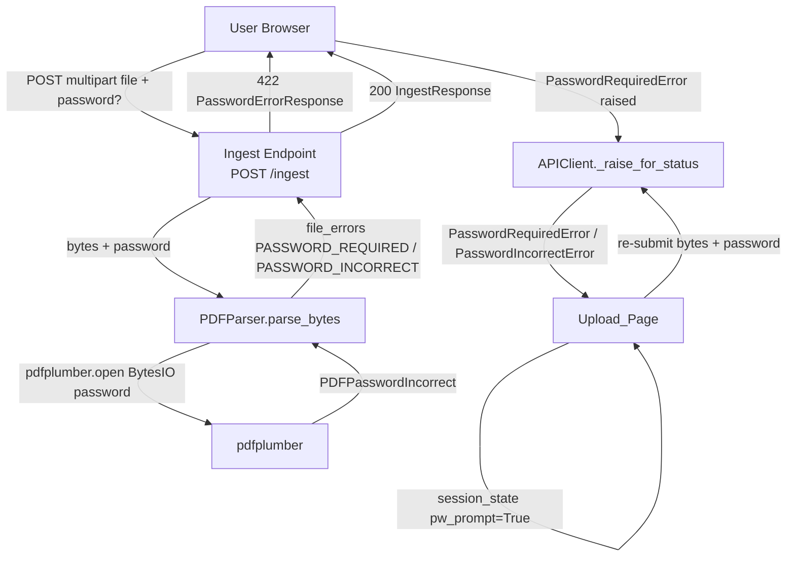
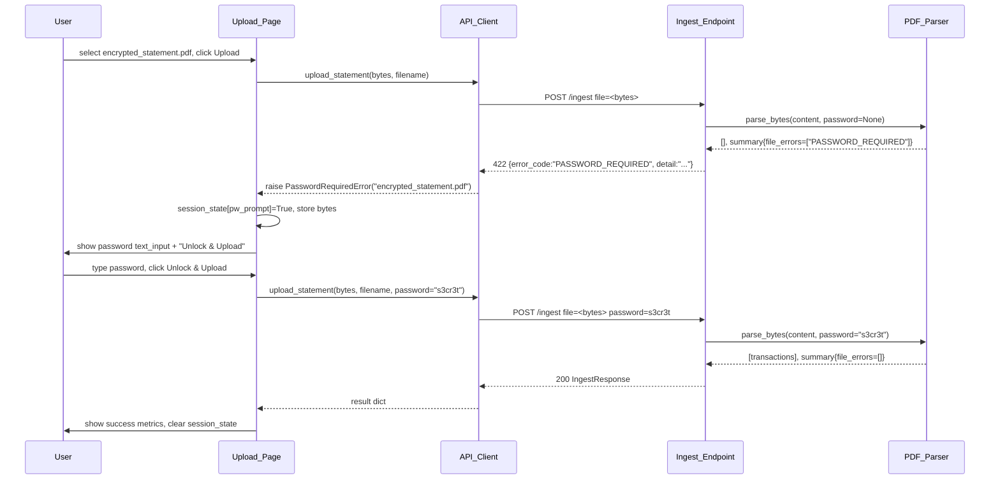
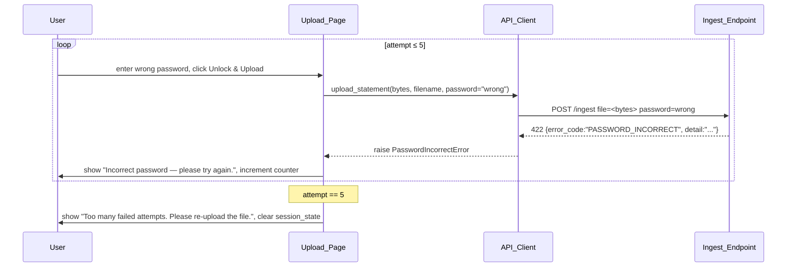

# Design Document: Password-Protected PDF Upload

## Overview

When a user uploads an encrypted PDF, FinSight AI currently surfaces a generic 422 error
that gives no actionable guidance. This feature adds end-to-end handling: the backend
returns a machine-readable `PASSWORD_REQUIRED` or `PASSWORD_INCORRECT` signal, the frontend
catches it and renders a password prompt (without requiring a re-upload), and the backend
decrypts the PDF entirely in memory — the password and decrypted bytes are never written to
disk or logs.

Five files are touched: `pdf_parser.py`, `models.py`, `app.py` (backend) and
`services/api.py`, `views/upload.py` (frontend). No new dependencies are required;
`pdfplumber` already accepts a `password` argument.

---

## Architecture



---

## Sequence Diagrams

### Happy Path — Encrypted PDF, Correct Password



### Wrong Password (up to 5 attempts)



---

## Components and Interfaces

### 1. `PDFParser` — `src/ingestion/pdf_parser.py`

**Purpose**: Accepts both file-path and in-memory bytes; uses `pdfplumber` with an optional
password to open encrypted PDFs.

**New / modified methods**:

```python
def parse(
    self,
    file_path: Path,
    password: str | None = None,
) -> tuple[list[Transaction], ParseSummary]:
    """Existing file-path entry point; delegates to parse_bytes after reading."""

def parse_bytes(
    self,
    content: bytes,
    filename: str,
    password: str | None = None,
) -> tuple[list[Transaction], ParseSummary]:
    """New in-memory entry point used by the Ingest_Endpoint for PDFs."""
```

**Password handling**:

- `pdfplumber.open(BytesIO(content), password=password)` — password is passed directly to
  the library; it never touches the filesystem.
- `PDFPasswordIncorrect` with `password is None` → `summary.file_errors.append("PASSWORD_REQUIRED")`
- `PDFPasswordIncorrect` with `password is not None` → `summary.file_errors.append("PASSWORD_INCORRECT")`
- Password is a local variable inside the method; it is never stored on `self`, written to
  `summary`, or included in any warning string.

---

### 2. `IngestResponse` / `PasswordErrorResponse` — `src/api/models.py`

```python
class PasswordErrorResponse(BaseModel):
    error_code: str          # "PASSWORD_REQUIRED" | "PASSWORD_INCORRECT"
    detail: str              # human-readable message

class IngestResponse(BaseModel):
    ingested: int
    skipped: int
    warnings: list[str] = []
    error_code: str | None = None   # present only on password errors (kept for forward-compat)
```

The `Ingest_Endpoint` returns `PasswordErrorResponse` (status 422) for password errors and
`IngestResponse` (status 200) for success. The `error_code` field on `IngestResponse` is
kept for forward-compatibility but is `None` on success.

---

### 3. `Ingest_Endpoint` — `src/api/app.py`

**Signature change**:

```python
@app.post("/ingest", response_model=IngestResponse)
async def ingest(
    file: UploadFile = File(...),
    password: str | None = Form(None),   # NEW — optional, never logged
) -> Response:
```

**Behaviour for PDFs**:

1. `content = await file.read()` — bytes in memory, no file write.
2. `parser.parse_bytes(content, filename, password=password)` — decrypt in-memory.
3. If `summary.file_errors` contains `"PASSWORD_REQUIRED"` or `"PASSWORD_INCORRECT"`:
   - return `JSONResponse(status_code=422, content=PasswordErrorResponse(...).model_dump())`
4. On success, return `IngestResponse(...)` as before.
5. For password-supplied PDFs, **skip** writing to `data/raw/`; for non-PDF or unprotected
   PDFs, maintain existing `data/raw/` behaviour.

**Security constraint**: The `password` variable is never passed to `logger.*`, never
included in `HTTPException(detail=...)`, and never written to any file.

---

### 4. `APIClient` — `src/frontend/services/api.py`

**New exception classes**:

```python
class PasswordRequiredError(Exception):
    """Raised when the backend returns error_code='PASSWORD_REQUIRED'."""
    def __init__(self, filename: str) -> None:
        self.filename = filename
        super().__init__(f"PDF is password-protected: {filename}")

class PasswordIncorrectError(Exception):
    """Raised when the backend returns error_code='PASSWORD_INCORRECT'."""
    def __init__(self, filename: str) -> None:
        self.filename = filename
        super().__init__(f"Incorrect password for: {filename}")
```

**Modified `_raise_for_status`**:

```python
@staticmethod
def _raise_for_status(response: requests.Response, filename: str = "") -> None:
    if response.ok:
        return
    try:
        body = response.json()
    except ValueError:
        body = {}
    error_code = body.get("error_code")
    if response.status_code == 422 and error_code == "PASSWORD_REQUIRED":
        raise PasswordRequiredError(filename)
    if response.status_code == 422 and error_code == "PASSWORD_INCORRECT":
        raise PasswordIncorrectError(filename)
    detail = body.get("detail") or response.text or response.reason or "unknown error"
    raise RuntimeError(f"Backend returned {response.status_code}: {detail}")
```

**Modified `upload_statement`**:

```python
def upload_statement(
    self,
    file_path: str | Path | None = None,
    *,
    file_bytes: bytes | None = None,
    filename: str | None = None,
    password: str | None = None,
) -> dict[str, Any]:
    """
    Two calling conventions:
      1. upload_statement(file_path)                — original; reads from disk
      2. upload_statement(file_bytes=b"...", filename="x.pdf", password="pw")
                                                    — in-memory re-submission
    Password is included as a form field, never in the URL.
    """
```

The password, when present, is added to the `files` dict as:

```python
files["password"] = (None, password)   # multipart text field
```

It is never placed in the URL path or query string.

---

### 5. `Upload_Page` — `src/frontend/views/upload.py`

**Session state keys**:

| Key | Type | Purpose |
|-----|------|---------|
| `pdf_bytes` | `bytes` | Raw buffer from `uploaded_file.getbuffer()` |
| `pdf_name` | `str` | Original filename |
| `pw_prompt` | `bool` | Whether the password prompt is shown |
| `pw_attempts` | `int` | Number of wrong passwords tried so far |

**Control flow**:

```
render():
  if not pw_prompt:
    show file_uploader (enabled)
    if Upload clicked:
      call upload_statement(bytes, filename)
      on PasswordRequiredError:
        store pdf_bytes, pdf_name, set pw_prompt=True, pw_attempts=0
      on RuntimeError:
        st.error(...)
      on success:
        _show_result(result)
  else:  # password prompt active
    show file_uploader (disabled)
    show st.text_input("PDF Password", type="password")
    show "Unlock & Upload" button
    if Unlock & Upload clicked:
      if password == "":
        st.warning("Password cannot be empty")
      else:
        call upload_statement(bytes, filename, password)
        on PasswordIncorrectError:
          pw_attempts += 1
          if pw_attempts >= 5:
            st.error("Too many failed attempts. Please re-upload the file.")
            clear_session_state()
          else:
            st.error("Incorrect password — please try again.")
        on success:
          _show_result(result)
          clear_session_state()
        on other RuntimeError:
          st.error(...)
          clear_session_state()
```

`clear_session_state()` deletes `pdf_bytes`, `pdf_name`, `pw_prompt`, `pw_attempts` from
`st.session_state`.

---

## Data Models

### `PasswordErrorResponse`

```python
class PasswordErrorResponse(BaseModel):
    error_code: Literal["PASSWORD_REQUIRED", "PASSWORD_INCORRECT"]
    detail: str
```

Validation rules:
- `error_code` must be one of the two known string literals.
- `detail` must be a non-empty human-readable string.

### `IngestResponse` (updated)

```python
class IngestResponse(BaseModel):
    ingested: int
    skipped: int
    warnings: list[str] = []
    error_code: str | None = None
```

The `error_code` field is `None` on every success path; it exists for structural symmetry
and forward-compatibility. Callers should treat any non-`None` value as an error.

---

## Error Handling

### Scenario 1: Encrypted PDF, No Password

- `PDFParser.parse_bytes` catches `PDFPasswordIncorrect` (password is `None`), appends
  `"PASSWORD_REQUIRED"` to `file_errors`.
- `Ingest_Endpoint` detects the sentinel, returns 422 + `PasswordErrorResponse`.
- `API_Client._raise_for_status` raises `PasswordRequiredError`.
- `Upload_Page` catches it, transitions to password-prompt state.

### Scenario 2: Encrypted PDF, Wrong Password

- Same as Scenario 1 but password is not `None` → sentinel is `"PASSWORD_INCORRECT"`.
- `Upload_Page` increments `pw_attempts`; if ≥ 5, clears state and shows terminal message.

### Scenario 3: Network / Server Error During Re-Submission

- `_raise_for_status` falls through to `RuntimeError`.
- `Upload_Page` catches it as `Exception`, shows `st.error`, clears session state so the
  user can start fresh.

### Scenario 4: Unencrypted PDF or CSV

- No change in existing behaviour; no `error_code` is set.

---

## Testing Strategy

### Unit Testing Approach

- `test_pdf_parser_password.py`: fixture encrypted PDF (created by `scripts/generate_pdf_fixtures.py`).
  - `parse_bytes(content, "enc.pdf", password=None)` → `file_errors == ["PASSWORD_REQUIRED"]`
  - `parse_bytes(content, "enc.pdf", password="wrong")` → `file_errors == ["PASSWORD_INCORRECT"]`
  - `parse_bytes(content, "enc.pdf", password="correct")` → returns expected transactions
  - Assert password string never appears in `summary.file_errors`, `summary.warnings`, or
    any `Transaction` field.
- `test_api_models.py`: `PasswordErrorResponse` field validation.
- `test_ingest_endpoint.py`: FastAPI `TestClient` with fixture PDF bytes.
  - Upload without password → 422, `error_code == "PASSWORD_REQUIRED"`.
  - Upload with wrong password → 422, `error_code == "PASSWORD_INCORRECT"`.
  - Upload with correct password → 200, `ingested > 0`.
- `test_api_client.py`: mock `requests.Response` bodies.
  - `_raise_for_status` on 422 + `PASSWORD_REQUIRED` body raises `PasswordRequiredError`.
  - `_raise_for_status` on 422 + `PASSWORD_INCORRECT` body raises `PasswordIncorrectError`.
  - `upload_statement` includes password as form field, never in query string.

### Property-Based Testing Approach

**Property Test Library**: `hypothesis`

Properties are enumerated in the Correctness Properties section below.

### Integration Testing Approach

End-to-end: start FastAPI `TestClient`, use `scripts/generate_pdf_fixtures.py` to produce a
real encrypted PDF (requires `pikepdf`), submit it via `TestClient`, assert round-trip.

---

## Security Considerations

- The password field is transmitted as `multipart/form-data`, not a URL query parameter, so
  it does not appear in HTTP access logs or browser history.
- In production the `FINSIGHT_API_URL` must be HTTPS; the `API_Client` does not enforce
  this but the requirement is documented.
- `PDFParser.parse_bytes` uses `io.BytesIO` so pdfplumber never touches the filesystem.
- For PDFs where a password is supplied, the `Ingest_Endpoint` skips the `data/raw/` write
  entirely, preventing the encrypted (or decrypted) byte stream from reaching disk.
- The password local variable goes out of scope when `parse_bytes` returns; Python GC will
  collect it. No special memory-wiping is applied (acceptable for this threat model).

---

## Performance Considerations

- `io.BytesIO` wrapping adds negligible overhead compared to a disk round-trip.
- `pdfplumber` holds the full PDF in memory during parsing; the existing 10 MB file-size
  limit in `PDFParser` already bounds peak memory usage.
- No additional latency is introduced on the happy path (unencrypted PDFs and CSVs
  continue to use the existing code path).

---

## Dependencies

No new Python packages. `pdfplumber` already uses `pdfminer.six` which exposes
`PDFPasswordIncorrect`; the `password` argument to `pdfplumber.open()` is documented and
stable. `io.BytesIO` is in the standard library. `pikepdf` is needed only in
`scripts/generate_pdf_fixtures.py` for test fixture generation (already listed as a dev
dependency if the fixture script is already present).

---

## Correctness Properties

*A property is a characteristic or behavior that should hold true across all valid
executions of a system — essentially, a formal statement about what the system should do.
Properties serve as the bridge between human-readable specifications and machine-verifiable
correctness guarantees.*

### Property 1: Password never appears in ParseSummary output

For any non-empty password string `pw`, after calling
`PDFParser.parse_bytes(content, filename, password=pw)`, the string `pw` SHALL NOT appear
in any element of `summary.file_errors`, `summary.warnings`, or any field of any returned
`Transaction` object.

**Validates: Requirements 2.5, 6.1, 6.2**

---

### Property 2: Correct-password parse is equivalent to unencrypted parse

For any valid encrypted PDF `content` with known password `pw`, the transactions returned
by `parse_bytes(content, filename, password=pw)` SHALL equal the transactions that would be
returned by `parse_bytes(decrypted_content, filename, password=None)` where
`decrypted_content` is the same PDF decrypted beforehand.

**Validates: Requirements 2.1, 2.2**

---

### Property 3: `_raise_for_status` raises typed exceptions for any password error body

For any 422 response body whose `error_code` field is `"PASSWORD_REQUIRED"`,
`API_Client._raise_for_status` SHALL raise `PasswordRequiredError` (not `RuntimeError` or
any other exception); and for any 422 body whose `error_code` is `"PASSWORD_INCORRECT"`, it
SHALL raise `PasswordIncorrectError`.

**Validates: Requirements 4.1, 4.2**

---

### Property 4: Password is transmitted as a multipart body field, never in the URL

For any `(file_bytes, filename, password)` triple where `password` is non-empty,
`upload_statement(file_bytes=file_bytes, filename=filename, password=password)` SHALL
produce a `PreparedRequest` whose URL contains no substring equal to `password`, and whose
body (or `files` dict) contains a field named `password` with the correct value.

**Validates: Requirements 5.5, 9.1**

---

### Property 5: Attempt counter terminates the prompt after exactly 5 wrong passwords

For any sequence of exactly 5 consecutive `PasswordIncorrectError` responses,
the `Upload_Page` SHALL show the unrecoverable error message on the 5th attempt, clear
`Session_State` keys `pdf_bytes`, `pdf_name`, `pw_prompt`, and `pw_attempts`, and restore
the file uploader to its enabled state.

**Validates: Requirements 7.1, 7.2, 7.3**

---

### Property 6: Session state is fully cleared after any terminal outcome

For any terminal upload outcome (success, unrecoverable error, or 5th wrong-password
attempt), the keys `pdf_bytes`, `pdf_name`, `pw_prompt`, and `pw_attempts` SHALL NOT be
present in `st.session_state` after the outcome is processed.

**Validates: Requirements 5.3, 6.5, 7.3**
